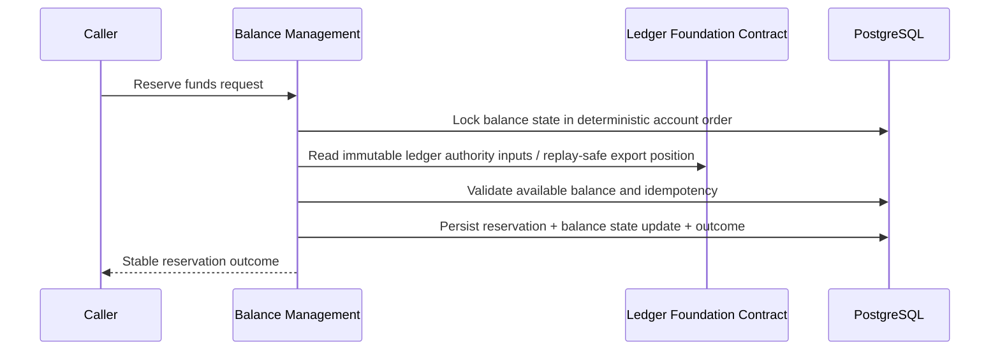
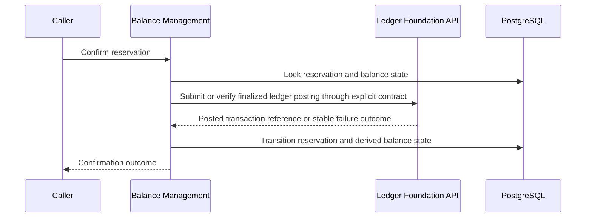
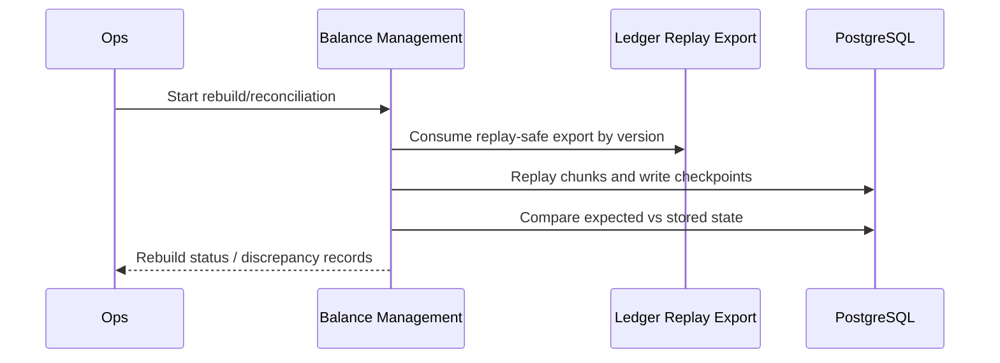

# Module Interaction Contracts: Account Balance Management

## Contract Ownership

| Contract | Owner | Consumer | Notes |
|---|---|---|---|
| Immutable journal-entry history export | Ledger Foundation | Balance Management | Replay-safe, additive, versioned |
| Posting outcome and transaction reference contract | Ledger Foundation | Balance Management | Used to trace finalized effects |
| Balance query API | Balance Management | Internal callers / downstream consumers | Derived-state authority |
| Reservation command API | Balance Management | Internal callers / workflow services | Protected writes fail closed |
| Rebuild and reconciliation operations | Balance Management | Operations / finance tooling | Operationally isolated |
| Accounting events | Ledger Foundation | Downstream consumers / balance-management replay tooling | Immutable authority only |
| Derived balance events | Balance Management | Downstream consumers | Reservation and recovery state only |

## Integration Sequence: Protected Reservation Write

## Integration Sequence: Reservation Confirmation

## Integration Sequence: Rebuild and Reconciliation

## Failure Isolation Scenarios

### Snapshot Projection Lag

- Ledger-foundation MAY continue unrelated ledger postings.
- Balance-management MUST fail closed for protected writes if lag exceeds the
  declared consistency contract.
- Read APIs MAY return derived snapshots with explicit freshness metadata when
  the contract permits it.

### Rebuild Failure

- Rebuild jobs MUST stop independently and record failure details.
- Live ledger posting MUST continue.
- Protected writes MAY continue if current-state invariants remain trustworthy.

### Reconciliation Failure

- Reconciliation failure MUST not block normal ledger posting.
- Drift detection MUST raise discrepancy records and observable alerts.
- Repair ownership stays with balance-management operators.

### Reservation Recovery Failure

- Affected reservations MUST remain in recoverable, traceable states.
- New protected writes against affected accounts MAY fail closed until recovery
  completes if the current-state guarantees are uncertain.

### Ledger Export Publication Failure

- Replay/export failure MUST not mutate ledger history.
- Balance-management rebuild/reconciliation functions MAY pause or degrade.
- Protected writes that need authoritative replay checkpoints MUST fail closed.

## Additive Evolution Rules

- All cross-module contracts MUST expose explicit versions.
- New fields MUST be additive and ignorable by older supported consumers.
- Replay exports MUST retain deterministic semantics for the full compatibility
  window of each supported version.
- Breaking contract changes require a documented migration path, compatibility
  window, rollout sequencing, and consumer impact analysis.

## Anti-Corruption Rules

- Balance-management MUST translate immutable ledger contracts into its own
  domain language rather than importing ledger persistence entities or mutable
  models directly.
- Downstream consumers MUST NOT infer immutable accounting authority from
  derived balance events alone.
- Rebuild tooling MUST consume exported contracts, not raw ledger table shapes.

## Deployment Topology Considerations

- Initial deployment remains one Spring Boot service and one PostgreSQL
  database.
- Balance-management components are packaged for later extraction into either:
  a dedicated balance service, a replay worker, or a read-optimized projection
  service.
- Extraction readiness depends on preserving:
  explicit HTTP/internal contracts, replay-safe exports, isolated schema
  ownership, and no direct table coupling.
