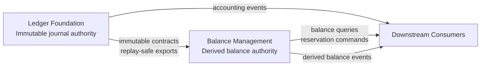
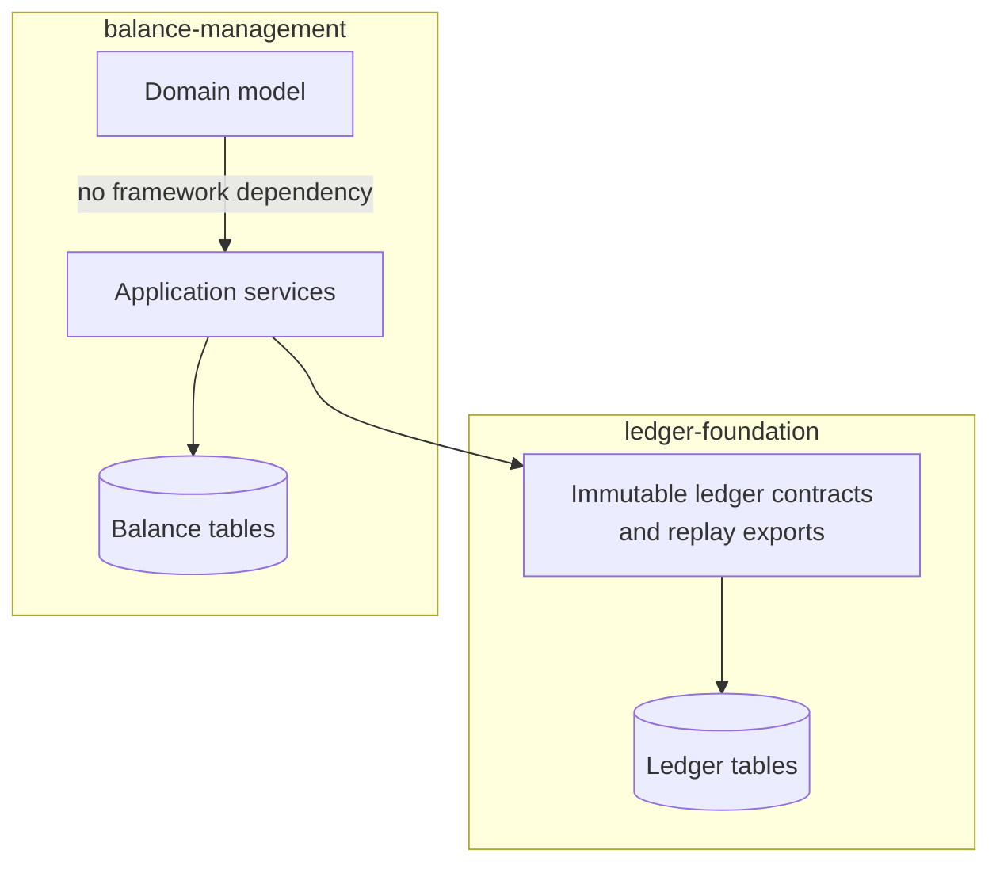
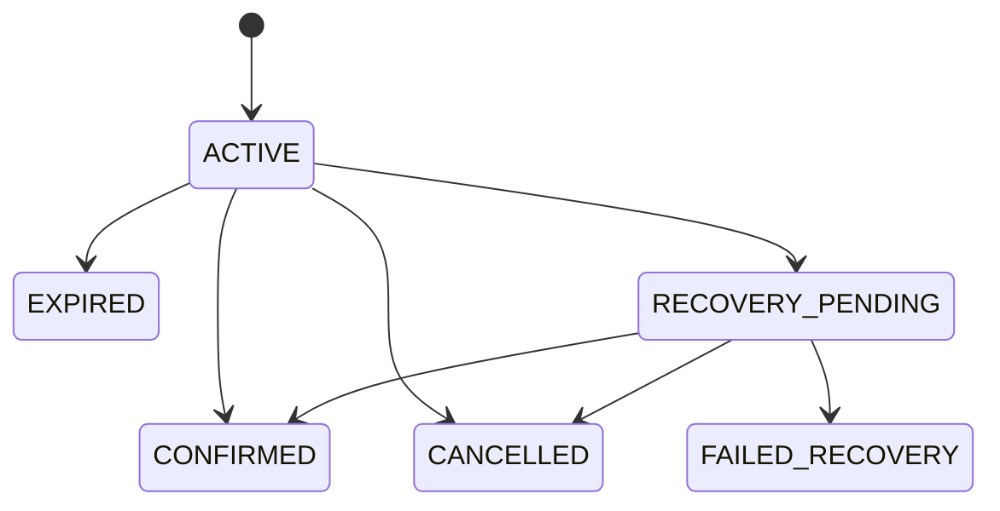

# Data Model: Account Balance Management

## Bounded Context Overview

## Ownership Matrix

| Concern | Ledger Foundation | Balance Management |
|---|---|---|
| Immutable journal entries | Owns | Consumes via contract only |
| Posting integrity and double-entry validation | Owns | Must not bypass |
| Posting idempotency record for ledger mutations | Owns | References only |
| Transaction references and accounting audit trail | Owns | References only |
| Current balance state | Exports authority inputs only | Owns |
| Balance snapshots and freshness markers | No ownership | Owns |
| Reservation lifecycle | No ownership | Owns |
| Available/pending/locked calculations | No ownership | Owns |
| Rebuild checkpoints and reconciliation records | No ownership | Owns |
| Replay export contract versions | Owns publisher contract | Consumes compatible versions |
| Derived balance/reservation events | Must not publish | Owns publisher contract |

## Dependency Diagram

Allowed dependency direction:

- `balance-management` MAY depend on immutable ledger contracts, replay exports,
  and additive views explicitly owned by `ledger-foundation`.
- `ledger-foundation` MUST NOT depend on balance-management internals,
  persistence models, or derived-state events.
- Both bounded contexts MAY depend on shared technical libraries already
  approved by the repository, but MUST NOT share mutable business state.

Forbidden dependencies:

- Direct reads or writes from balance-management into ledger-foundation tables
  for live operations.
- Shared JPA entities, repositories, or mutable persistence records across
  bounded contexts.
- Hidden transactional assumptions that require both contexts to update one
  mutable record set together.

## Balance State

Derived authoritative current state used by protected balance writes.

### Fields

- `account_id`: Stable account identifier.
- `currency`: Currency code for the account balance state.
- `ledger_balance`: Finalized balance derived from committed immutable ledger
  history.
- `locked_amount`: Total active reserved amount unavailable for new protected
  debits.
- `pending_debit_amount`: Total not-yet-finalized debit exposure.
- `pending_credit_amount`: Total not-yet-finalized credit exposure.
- `available_balance`: Derived value
  `ledger_balance - locked_amount - pending_debit_amount + pending_credit_amount`.
- `version`: Monotonic conflict marker for stale-write detection.
- `ledger_as_of_sequence`: Last applied ledger export or posting sequence.
- `reservation_as_of_sequence`: Last applied reservation lifecycle sequence.
- `reconciliation_status`: `HEALTHY`, `DRIFT_DETECTED`, `REBUILDING`, or
  `RECOVERY_REQUIRED`.
- `updated_at`: Last successful protected-write timestamp.

### Relationships

- Has many `Funds Reservation` records.
- Is explained by immutable ledger history plus reservation history.
- Is reconciled by `Balance Reconciliation Record`.

### Validation Rules

- One row per `account_id` + `currency`.
- `available_balance` must equal the documented formula.
- `version` must increase on every committed protected write.
- Finalized ledger balance must not be mutated from non-ledger sources.

## Balance Snapshot

Read-optimized representation of current balance state for queries and
downstream consumers.

### Fields

- `snapshot_id`: Snapshot identifier.
- `account_id`: Account identifier.
- `currency`: Currency code.
- `ledger_balance`: Finalized balance view.
- `locked_amount`: Active locked funds.
- `pending_debit_amount`: Pending outgoing funds.
- `pending_credit_amount`: Pending incoming funds.
- `available_balance`: Computed spendable amount.
- `snapshot_version`: Monotonic snapshot version.
- `as_of_sequence`: Source point used for the snapshot.
- `as_of_time`: Timestamp corresponding to the snapshot freshness point.
- `consistency_mode`: `STRONG` or `DERIVED`.
- `created_at`: Snapshot creation timestamp.

### Validation Rules

- Snapshot fields must remain derivable from `Balance State`, ledger history,
  and reservation history.
- Snapshot consumers must receive freshness metadata.

## Funds Reservation

Traceable temporary hold used to protect spend or pending settlement flows.

### Fields

- `reservation_id`: Stable reservation identifier.
- `request_id`: Idempotent caller request identifier.
- `requester_scope`: Caller scope for reservation idempotency.
- `account_id`: Target account identifier.
- `currency`: Currency code.
- `direction`: `DEBIT` or `CREDIT`.
- `amount`: Positive decimal amount.
- `business_reference`: External business or workflow reference.
- `status`: `ACTIVE`, `CONFIRMED`, `EXPIRED`, `CANCELLED`, `RECOVERY_PENDING`,
  or `FAILED_RECOVERY`.
- `expires_at`: Expiration timestamp.
- `ledger_transaction_id`: Optional finalized ledger transaction reference.
- `confirmation_reference`: Confirmation command reference.
- `created_at`: Creation timestamp.
- `updated_at`: Latest lifecycle timestamp.

### Relationships

- Belongs to one `Balance State`.
- May resolve into one ledger transaction reference.
- Produces derived balance events and recovery traces.

### Validation Rules

- `requester_scope` + `request_id` must be unique for one reservation intent.
- Status transitions must be exactly-once and idempotent.
- Confirm, cancel, expire, and recovery flows must never double-release or
  double-lock the same amount.

### State Transitions

## Balance Mutation Request

Command model for reservation, confirmation, release, or recovery-triggering
 operations.

### Fields

- `request_id`: Stable caller idempotency key.
- `requester_scope`: Caller/source scope.
- `mutation_type`: `RESERVE`, `CONFIRM`, `CANCEL`, `EXPIRE`, `RELEASE`, or
  `RECOVER`.
- `account_ids`: One or more target account identifiers.
- `currency`: Currency code.
- `amount`: Requested amount.
- `actor_id`: Initiating actor.
- `actor_type`: `USER`, `SYSTEM`, or `SERVICE`.
- `correlation_id`: Workflow correlation identifier.
- `causation_id`: Optional upstream causation reference.
- `business_reference`: External reference.

### Validation Rules

- Mutating requests must include stable idempotency identity.
- Multi-account requests must define deterministic account ordering.
- Request reuse with conflicting intent must return a stable conflict outcome.

## Balance Rebuild Job

Long-running replay job that reconstructs derived balance state from immutable
history and reservation records.

### Fields

- `job_id`: Rebuild job identifier.
- `scope`: Account range or selection criteria.
- `replay_contract_version`: Ledger export version being consumed.
- `status`: `PENDING`, `RUNNING`, `SUCCEEDED`, `FAILED`, or `CANCELLED`.
- `checkpoint_token`: Restart marker.
- `processed_record_count`: Progress counter.
- `started_at`: Start timestamp.
- `finished_at`: Completion timestamp.
- `requested_by`: Actor or system owner.
- `failure_reason`: Sanitized failure summary.

### Validation Rules

- Re-running with the same source history must produce the same derived result.
- Restart from checkpoint must not duplicate replay effects.
- Jobs must not block unrelated live ledger postings.

## Balance Rebuild Checkpoint

Persistent marker that allows replay jobs to resume safely.

### Fields

- `checkpoint_id`: Checkpoint identifier.
- `job_id`: Parent rebuild job.
- `account_id`: Last fully processed account or range marker.
- `ledger_sequence`: Last consumed ledger export sequence.
- `reservation_sequence`: Last consumed reservation sequence.
- `created_at`: Checkpoint creation timestamp.

## Balance Reconciliation Record

Traceable result of comparing stored derived state with replayed expected state.

### Fields

- `reconciliation_id`: Reconciliation identifier.
- `account_scope`: Compared account or range.
- `expected_balance`: Replayed expected balance summary.
- `actual_balance`: Stored balance summary.
- `difference_summary`: Structured discrepancy payload.
- `severity`: `INFO`, `WARNING`, or `CRITICAL`.
- `status`: `OPEN`, `ACKNOWLEDGED`, `REPAIRED`, or `FALSE_POSITIVE`.
- `investigation_reference`: External incident or ticket reference.
- `created_at`: Detection timestamp.
- `updated_at`: Latest status timestamp.

### Validation Rules

- Every detected drift must be recorded once per reconciliation run and scope.
- Repair actions must not mutate immutable ledger history.

## Event Ownership

### Ledger-Foundation Event Authority

- `LEDGER_POSTED`
- `LEDGER_REJECTED`
- `LEDGER_IDEMPOTENCY_CONFLICT`
- `LEDGER_EXPORT_CHECKPOINTED`

### Balance-Management Event Authority

- `BALANCE_RESERVED`
- `BALANCE_RESERVATION_CONFIRMED`
- `BALANCE_RESERVATION_RELEASED`
- `BALANCE_RESERVATION_EXPIRED`
- `BALANCE_REBUILD_STARTED`
- `BALANCE_REBUILD_COMPLETED`
- `BALANCE_RECONCILIATION_DETECTED`

Downstream consumers MUST interpret ledger-foundation events as immutable
accounting history and balance-management events as derived operational state.
