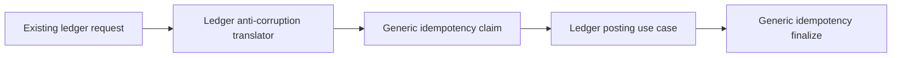
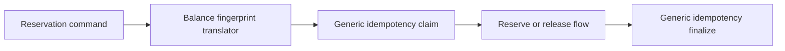

# Consumer Onboarding Contract: Idempotency Framework

## Purpose

Define how existing and future modules adopt the generic idempotency framework
without breaking current behavior or forcing a big-bang migration.

## Consumer Responsibilities

Every adopting consumer module must define:

- the uniqueness boundary for each protected operation
- the material request fields used for fingerprinting
- the canonicalization profile that excludes transport metadata
- the replay payload shape or replay reference
- the terminal and indeterminate outcomes it may emit
- the retention policy profile appropriate for that workflow
- the explicit transaction boundary around claim, business work, and finalize

## Onboarding Profiles

### Profile A: New Module Adoption

Use for new ledger-adjacent modules, webhooks, and asynchronous jobs that do
not already have a dedicated idempotency implementation.

Requirements:

- integrate directly with the generic application ports
- persist outcomes only through the framework store
- define consumer-local anti-corruption translation from protocol payload to
  fingerprintable request model
- ensure headers, transport timestamps, and protocol wrappers are removed
  before fingerprint calculation

### Profile B: Existing Module Coexistence

Use for existing `ledger` and `balance` flows that already have dedicated
idempotency records.

Requirements:

- preserve current public behavior while introducing translation layers to the
  generic framework
- onboard one protected operation family at a time
- do not delete or rewrite existing idempotency tables until coexistence and
  replay parity are proven
- keep existing replay/conflict semantics stable while mapping them to the new
  replay-window and tombstone-retention model

### Profile C: Long-Running or Asynchronous Workflow

Use for background jobs, callbacks, and multi-step workflows.

Requirements:

- support `DUPLICATE_IN_PROGRESS` and `INDETERMINATE` as first-class outcomes
- define recovery ownership for records left in active or uncertain states
- define cleanup rules that do not erase unfinished audit evidence
- define when long-running workflows stop replaying full outcomes but continue
  blocking re-execution through tombstones

## Integration Sequence: Ledger Posting Migration Path

Rules:

- ledger-specific response codes and outcome semantics remain backward
  compatible
- translation must preserve canonical request-intent behavior for supported
  retries while excluding transport metadata from fingerprinting
- existing `ledger_idempotency_records` may coexist until parity verification
  is complete

## Integration Sequence: Balance Reservation Adoption

Rules:

- reservation lifecycle rules remain owned by the balance module
- duplicate replay must preserve existing reserve/confirm/release outcomes
- balance-specific retention tuning may use a stricter policy profile than
  non-financial consumers, but must still follow replay-window then tombstone
  semantics

## Rollout Guardrails

- Consumer onboarding must be additive and reversible.
- Every migrated operation family must have characterization tests against the
  pre-migration duplicate and conflict behavior.
- If a consumer cannot safely fingerprint its request intent, it must not adopt
  the framework until that ambiguity is resolved.
- Policy profiles for financial mutations must default to fail-closed behavior
  for expired, in-progress, or indeterminate outcomes.

## Zero-Downtime Sequencing

1. Deploy `V3__create_idempotency_framework.sql` before any consumer switches
   to the shared module.
2. Deploy application code that can coexist with the new shared tables while
   existing `ledger` and `balance` idempotency tables remain authoritative for
   untouched operation families.
3. Migrate one operation family at a time behind characterization coverage and
   replay-parity checks.
4. Keep legacy tables readable until the migrated flow has passed replay,
   conflict, concurrency, and retention verification in production-like
   environments.
5. Treat legacy table removal as a later explicit migration, not part of the
   foundational framework rollout.

## Required Verification Per Consumer

- first execution and replay outcome parity
- conflicting key reuse detection
- concurrent duplicate suppression across multiple application instances
- indeterminate outcome handling and recovery visibility
- expiration and tombstone behavior
- zero-downtime rollout sequencing for any new schema or adapter switch
