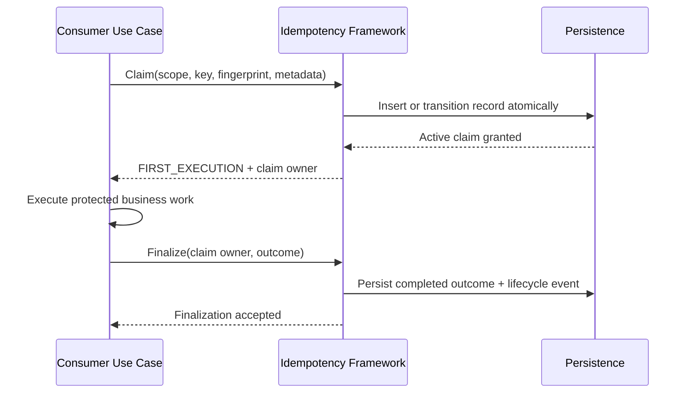
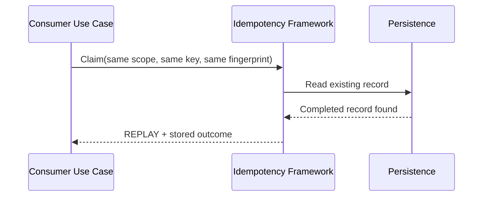
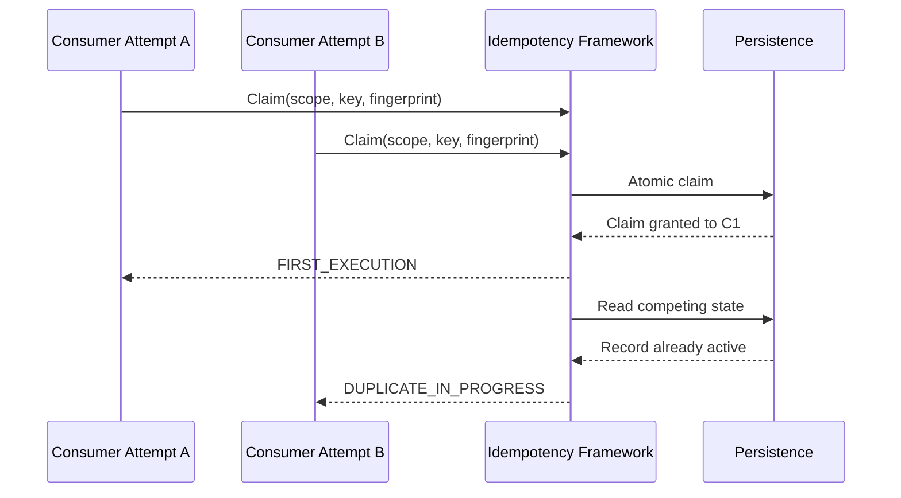

# Idempotency Module Contracts

## Contract Ownership

| Contract | Owner | Consumer | Notes |
|---|---|---|---|
| Claim protected request | Idempotency Framework | Ledger / Balance / Future modules | Determines first execution, replay, conflict, or duplicate-in-progress |
| Finalize protected request | Idempotency Framework | Ledger / Balance / Future modules | Records terminal or indeterminate outcome |
| Replay completed outcome | Idempotency Framework | Delivery adapters / consumer use cases | Returns stable stored outcome |
| Expire or archive records | Idempotency Framework | Operations tooling | Applies retention and tombstone policy |
| Inspect lifecycle history | Idempotency Framework | Support / compliance / consumers | Audit-focused read contract |

## Core Application Contract

### Claim Request

Consumer supplies:

- scope type
- scope value
- operation kind
- policy profile
- idempotency key
- request fingerprint
- canonicalization profile identifier
- business reference
- actor context
- correlation and causation identifiers

Framework returns one of:

- `FIRST_EXECUTION`: caller may proceed with protected business work
- `REPLAY`: prior completed outcome is returned, no new work allowed
- `DUPLICATE_IN_PROGRESS`: another attempt currently owns the active claim
- `CONFLICT`: same scope/key reused with different fingerprint or intent
- `EXPIRED_KEY`: key is beyond the replay window and is now governed only by
  tombstone policy
- `INDETERMINATE`: prior attempt exists but final effect is uncertain

### Finalize Request

Consumer supplies:

- claim owner token
- final outcome type
- stable response code
- sanitized replay payload or business reference
- finalization timestamp
- optional indeterminate reason

Framework guarantees:

- only the current claim owner may finalize the active attempt
- finalization is idempotent for the same claim owner and outcome
- duplicate or stale finalization attempts are rejected deterministically

### Lifecycle Inspection Contract

Consumers and operational tooling may request:

- current record state
- current retention status
- stored replay outcome
- timestamps for first seen, last seen, and finalization
- replay window and tombstone expiry timestamps
- lifecycle events
- business and correlation identifiers

Inspection must not expose secrets or protocol-specific raw payloads unless
explicitly approved by future security rules.

## Sequence: First Execution

## Sequence: Duplicate Replay

## Sequence: Concurrent Duplicate

## Failure Handling Rules

- A claim that was granted but never finalized must remain visible for recovery
  and duplicate suppression.
- An indeterminate downstream effect must not be silently converted into
  completed success or fresh retry eligibility.
- Cleanup must not delete records that are still within tombstone retention.
- Conflict detection must preserve the original record and return a stable
  conflict outcome.
- Canonicalization rules must remain stable for a supported fingerprint version;
  changes require explicit versioning rather than silent re-interpretation.

## Evolution Rules

- New response fields must be additive and ignorable by older supported
  consumers.
- Policy profiles may expand, but existing profile semantics must remain stable
  for their documented compatibility window.
- Persistence implementations may vary, but claim and finalization semantics
  must stay behaviorally equivalent.
