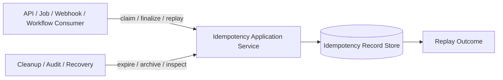
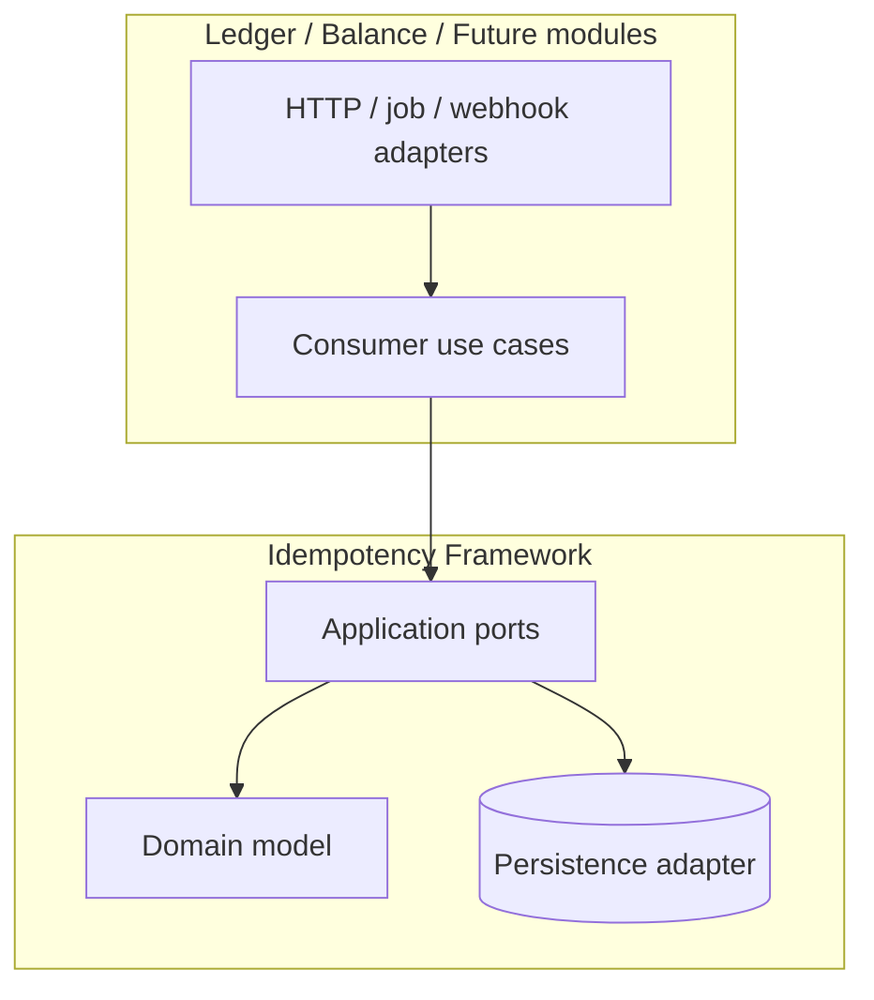
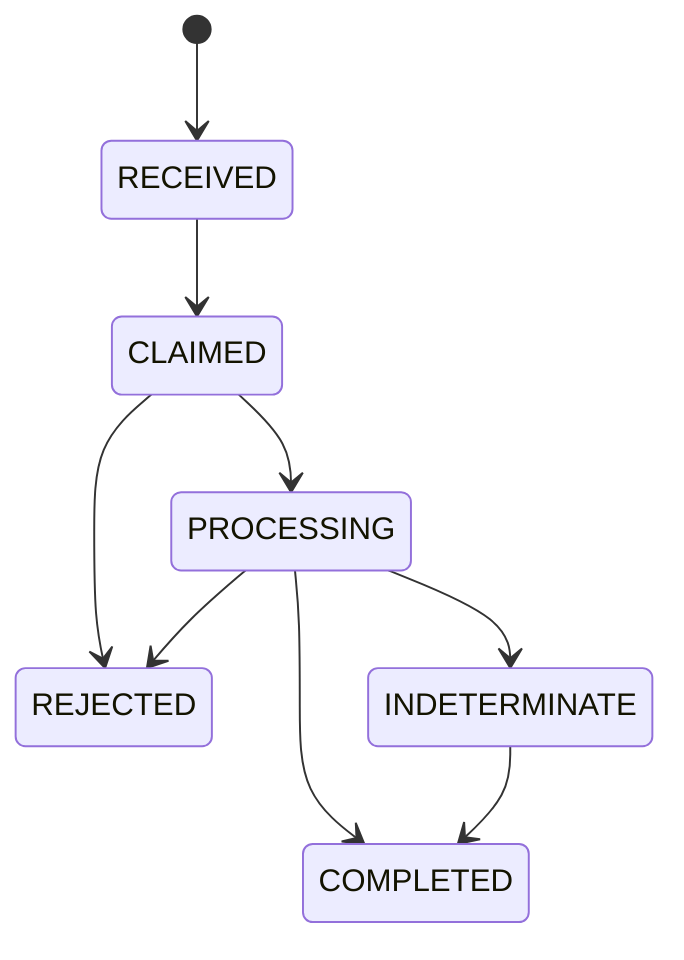

# Data Model: Idempotency Framework

## Bounded Context Overview

## Ownership Matrix

| Concern | Idempotency Framework | Consumer Module |
|---|---|---|
| Scope and key validation rules | Owns | Supplies scope values |
| Request fingerprint evaluation | Owns contract | Supplies material request content |
| Duplicate claim and replay lifecycle | Owns | Consumes outcomes |
| Business side effect execution | Must not own | Owns |
| Final business outcome payload | Stores normalized replay form | Produces |
| Expiration and tombstone policy | Owns framework policy hooks | May choose policy profile |
| Audit correlation and business identifiers | Stores | Supplies |
| Delivery protocol details | Must not own | Owns adapter-specific translation |

## Dependency Diagram

Allowed dependency direction:

- Consumer modules MAY depend on idempotency application ports and value
  objects.
- The idempotency framework MUST NOT depend on consumer domain entities,
  consumer JPA models, or business-specific transaction logic.
- Delivery adapters MAY translate protocol details into idempotency requests,
  but domain/application logic must remain delivery-agnostic.

Forbidden dependencies:

- Consumer modules sharing raw idempotency persistence entities.
- The framework directly invoking consumer business operations through hidden
  callbacks that obscure transaction boundaries.
- Protocol headers, queue metadata, or framework annotations leaking into the
  idempotency domain model.

## Idempotency Scope

Declares where a key must be unique and what kind of operation it protects.

### Fields

- `scope_type`: Category such as tenant, account, workflow, integration, or
  module-defined namespace.
- `scope_value`: Stable identifier inside that scope type.
- `operation_kind`: Consumer-defined protected operation class.
- `policy_profile`: Retention and replay policy selection.

### Validation Rules

- The tuple `scope_type + scope_value + operation_kind` must uniquely define
  the collision boundary for one protected operation family.
- Scope definitions must be stable across retries.
- Policy profiles must be declared explicitly; consumers must not rely on
  implicit defaults they cannot audit.

## Idempotency Key

Caller-supplied identity used to correlate retries.

### Fields

- `key_value`: Raw caller key.
- `issued_at`: Optional caller-provided issue time when available.
- `expires_at`: Framework-computed replay expiration boundary.
- `tombstone_expires_at`: Framework-computed final retention boundary.

### Validation Rules

- `key_value` must be present, non-blank, and conform to agreed format limits.
- Keys may repeat only across different scopes or operation kinds.
- Expiration windows must be derived deterministically from the policy profile.

## Request Fingerprint

Stable representation of the material request intent.

### Fields

- `fingerprint_value`: Stable hash or equivalent opaque representation.
- `fingerprint_version`: Version identifier for the fingerprinting rules.
- `material_fields_summary`: Audit-safe summary of the fields that influenced
  the fingerprint.
- `canonicalization_profile`: Identifier for the normalization rules used to
  build the canonical business-intent object.

### Validation Rules

- The same logical request must always produce the same fingerprint for the
  same fingerprint version and canonicalization profile.
- Material changes in protected intent must change the fingerprint.
- The summary must remain audit-safe and exclude secrets or sensitive payloads
  that should not be replayed in full.
- Transport metadata such as trace headers, protocol wrappers, request
  timestamps, and adapter-only values must not affect the fingerprint.

## Idempotency Record

Durable aggregate that governs duplicate detection and replay.

### Fields

- `record_id`: Stable internal record identifier.
- `scope`: Associated `Idempotency Scope`.
- `key`: Associated `Idempotency Key`.
- `fingerprint`: Associated `Request Fingerprint`.
- `state`: `RECEIVED`, `CLAIMED`, `PROCESSING`, `COMPLETED`, `REJECTED`, or
  `INDETERMINATE`.
- `claim_owner`: Opaque owner token for the active processing attempt.
- `claim_acquired_at`: Timestamp when the active claim was granted.
- `last_transition_at`: Timestamp of most recent lifecycle change.
- `first_seen_at`: Timestamp of initial receipt.
- `last_seen_at`: Timestamp of latest duplicate observation.
- `replay_window_expires_at`: Timestamp until which the full stored outcome may
  be replayed.
- `tombstone_expires_at`: Timestamp until which duplicate re-execution remains
  blocked after the replay window ends.
- `retention_status`: `REPLAYABLE`, `TOMBSTONED`, or `PURGE_ELIGIBLE`.
- `business_reference`: Consumer-provided business identifier.
- `correlation_id`: Trace or workflow correlation identifier.
- `causation_id`: Optional upstream cause identifier.
- `attempt_count`: Number of observed attempts for the same key.

### Relationships

- Owns one `Replay Outcome`.
- Owns many `Lifecycle Event` entries.
- Belongs to one `Idempotency Scope`.

### Validation Rules

- Exactly one active claim may exist for a record in `CLAIMED` or `PROCESSING`.
- A conflicting fingerprint must never overwrite the accepted fingerprint for an
  existing record.
- Once `COMPLETED`, the record must not return to an active processing state.
- `retention_status` may change only after the record is already in a terminal
  processing state.

### State Transitions

Retention handling after terminal processing:

- `COMPLETED`, `REJECTED`, or `INDETERMINATE` records start as `REPLAYABLE`.
- After the replay window ends, records move to `TOMBSTONED`.
- After the tombstone window ends, records become `PURGE_ELIGIBLE`.

## Replay Outcome

Normalized stored result returned for safe duplicate replays.

### Fields

- `outcome_type`: `FIRST_EXECUTION`, `REPLAY`, `DUPLICATE_IN_PROGRESS`,
  `CONFLICT`, `EXPIRED_KEY`, or `INDETERMINATE`.
- `response_code`: Stable consumer-facing result code.
- `response_payload`: Sanitized replayable payload or reference.
- `http_status_hint`: Optional delivery-layer hint for HTTP adapters.
- `business_result_reference`: Optional reference to the created business
  effect, such as transaction ID or job ID.
- `finalized_at`: Timestamp when the outcome became durable.

### Validation Rules

- Replay payloads must be stable for identical retries.
- Payload storage must remain auditable without leaking secrets.
- In-progress and indeterminate results must be distinguishable from completed
  replay outcomes.

## Lifecycle Event

Audit trail for transitions and duplicate observations.

### Fields

- `event_id`: Stable lifecycle event identifier.
- `record_id`: Parent idempotency record.
- `event_type`: `CLAIM_GRANTED`, `DUPLICATE_SEEN`, `CONFLICT_DETECTED`,
  `PROCESSING_STARTED`, `COMPLETED`, `REPLAY_WINDOW_ELAPSED`,
  `TOMBSTONE_ELAPSED`, `ARCHIVED`, or `INDETERMINATE_RECORDED`.
- `recorded_at`: Event timestamp.
- `actor_type`: `USER`, `SYSTEM`, or `SERVICE`.
- `actor_id`: Initiator or processor identity.
- `details`: Audit-safe structured metadata.

### Validation Rules

- Events must be append-only.
- Every terminal transition must have at least one corresponding lifecycle
  event.
- Cleanup actions must remain traceable through lifecycle events or archival
  metadata.
