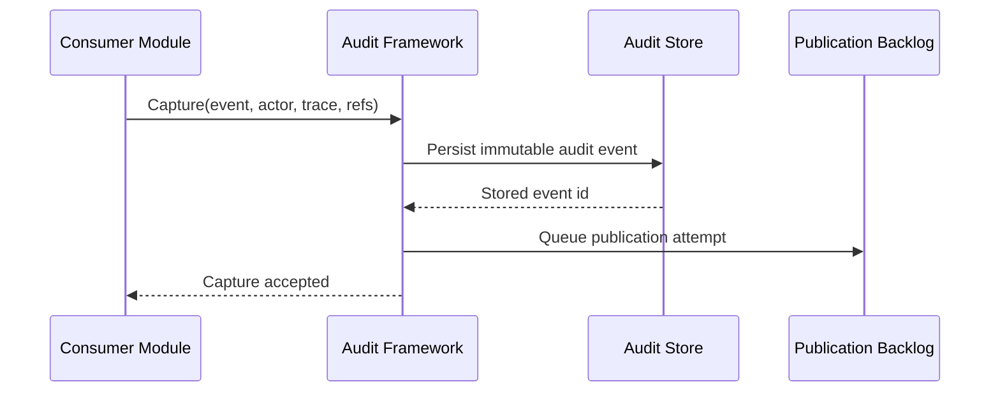
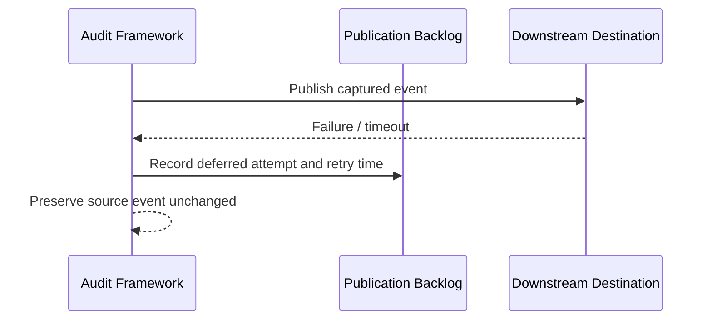
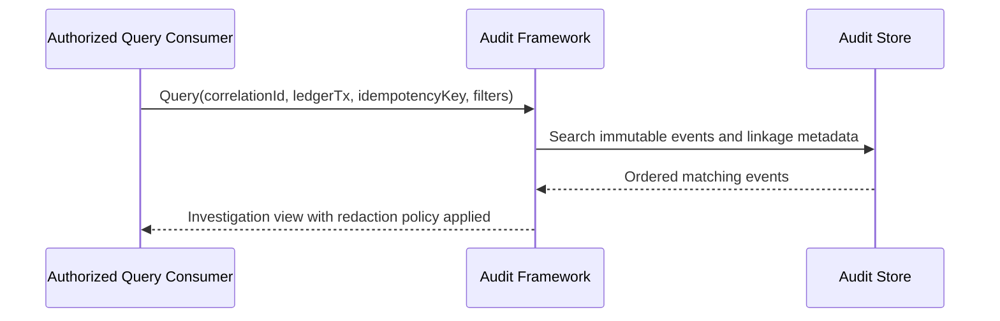

# Audit Framework Contracts

## Contract Ownership

| Contract | Owner | Consumer | Notes |
|---|---|---|---|
| Capture audit event | Audit Framework | Ledger / Balance / Future modules | Durable immutable evidence capture |
| Query investigation history | Audit Framework | Support / Compliance / authorized systems | Search and reconstruct event history |
| Publish downstream audit event | Audit Framework | Downstream sinks / integrations | Operational delivery outside business success path |
| Process retention transitions | Audit Framework | Operations tooling | Applies retention and disposition policy |
| Verify integrity | Audit Framework | Operations / compliance | Detects tampering or chain gaps |

## Core Application Contracts

### Capture Request

Producer supplies:

- event type
- schema version
- module name
- event time
- business subject type and identifier
- business reference
- optional state transition summary
- audit-safe details
- actor identity fields
- trace context fields
- optional ledger transaction reference
- optional idempotency reference
- retention policy profile

Framework guarantees:

- the event is stored immutably if the capture request is accepted
- missing optional actor or trace details are represented explicitly
- downstream publication failure does not invalidate the already captured event
- duplicate capture of the same business event must be handled by producer-side
  rules or explicit framework deduplication policy where configured

### Investigation Query Request

Authorized consumers may search by:

- business subject type and identifier
- business reference
- actor type or actor identifier
- event type
- module name
- time range
- correlation identifier
- request identifier
- ledger transaction reference
- idempotency key
- idempotency record identifier

Framework returns:

- ordered immutable events
- explicit linkage metadata
- retention and integrity status
- redacted or filtered fields according to access policy

### Publication Backlog Contract

Framework supplies:

- captured event identifier
- destination classification
- delivery payload shaped from the immutable event
- prior publication attempts
- retry eligibility and next retry time

Operational guarantees:

- publication attempts are traceable
- retries do not create duplicate source events
- failed publication remains operationally visible

### Retention Processing Contract

Framework evaluates:

- active retention expiry
- restricted retention expiry
- regulatory classification
- legal or operational hold flags when applicable

Framework outputs:

- retention transition event
- updated access classification
- disposition eligibility status

### Integrity Verification Contract

Framework verifies:

- immutable content digest
- expected chain linkage
- event existence across retained records

Framework outputs:

- verification timestamp
- verification result
- failure classification when proof validation fails

## Sequence: Business-Critical State Change

## Sequence: Publication Failure

## Sequence: Investigation Query

## Failure Handling Rules

- Capture rejection must occur only for invalid contract data or access-policy
  failures, not because downstream publication is unavailable.
- Publication failure must remain an operational concern, not a reason to
  mutate or delete the source event.
- Missing actor or trace values must be represented explicitly and must not be
  replaced with fabricated identifiers.
- Integrity verification failure must be observable and reviewable.
- Retention transitions must never silently erase required compliance evidence.

## Evolution Rules

- New contract fields must be additive and ignorable by older supported
  consumers.
- New event taxonomy values may be added, but existing meanings must remain
  stable.
- Query filters may expand, but existing filter semantics must remain backward
  compatible.
- Integrity-proof rules require explicit versioning instead of silent change.
