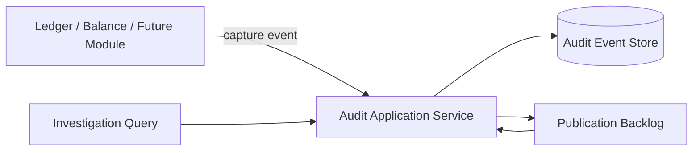
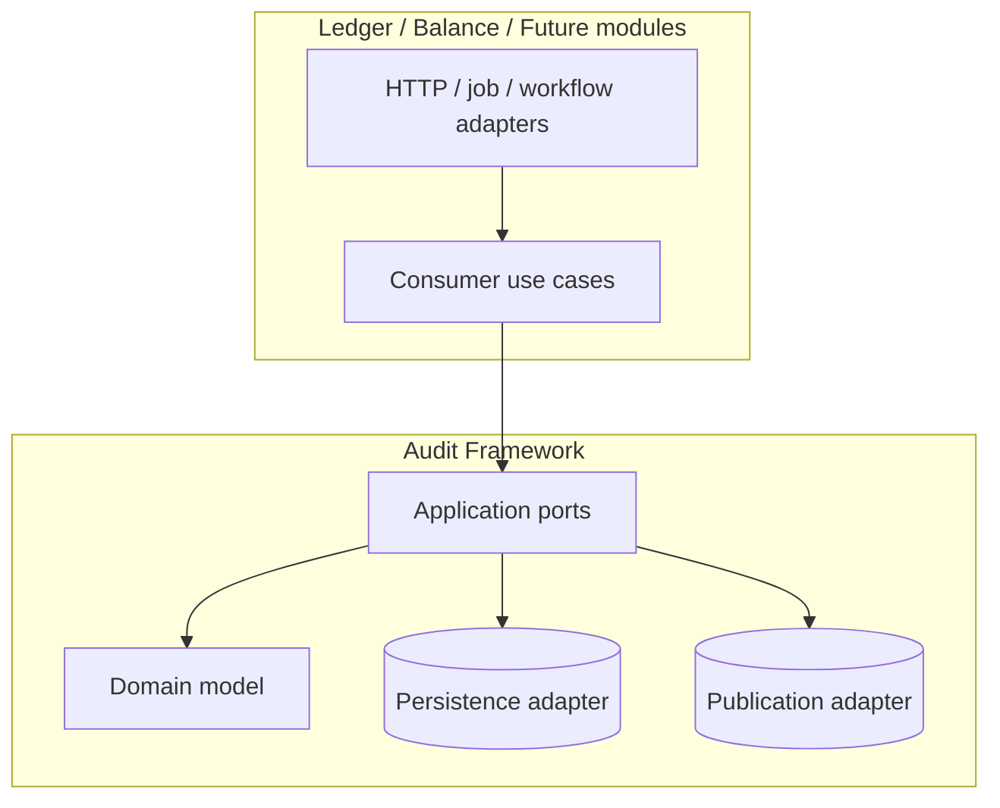
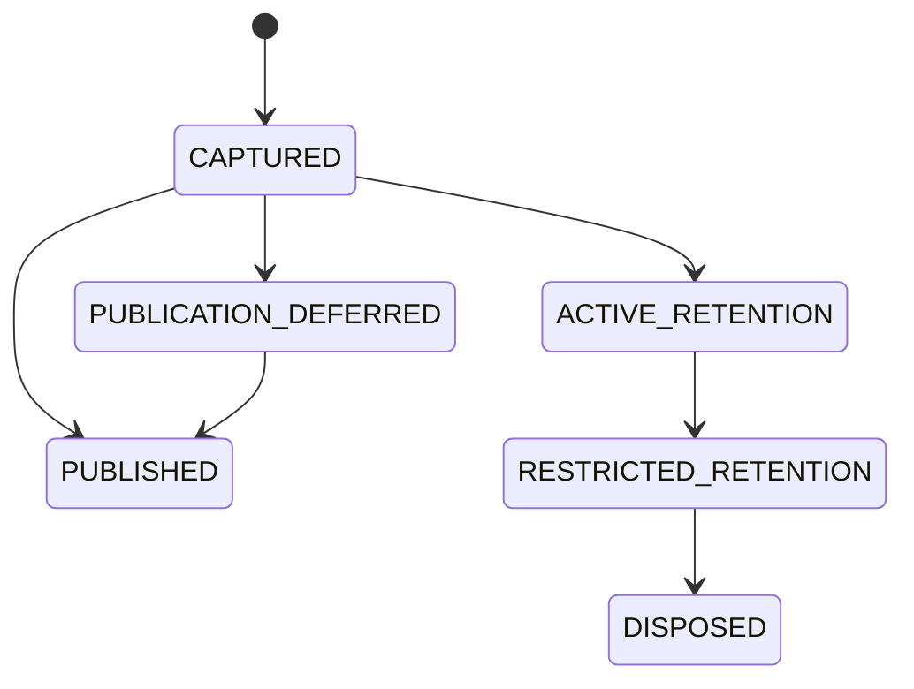

# Data Model: Audit Trail Framework

## Bounded Context Overview

## Ownership Matrix

| Concern | Audit Framework | Consumer Module |
|---|---|---|
| Shared audit event contract | Owns | Supplies business data |
| Actor and trace normalization | Owns | Supplies available values |
| Durable audit storage | Owns | Must not bypass |
| Ledger/idempotency cross-links | Owns contract | Supplies source references |
| Business state authority | Must not own | Owns |
| Publication backlog behavior | Owns | Consumes downstream exports if needed |
| Retention and integrity verification | Owns | May choose policy profile when allowed |
| Investigation query behavior | Owns | May invoke through authorized adapters |

## Dependency Diagram

Allowed dependency direction:

- Consumer modules MAY depend on audit application ports and audit value
  objects.
- The audit framework MUST NOT depend on ledger aggregates, balance JPA
  entities, or idempotency persistence internals.
- Delivery adapters MAY translate protocol details into audit capture and query
  requests, but the domain/application model must remain transport-agnostic.

Forbidden dependencies:

- Consumer modules sharing raw audit persistence entities.
- The audit framework becoming the source of truth for business or ledger
  state.
- Hidden framework interception that captures events without explicit consumer
  participation and transaction-boundary review.

Implementation notes:

- The first PostgreSQL adapter stores immutable audit event rows plus
  integrity-link metadata and publication backlog state.
- Query reads use investigation-specific indexes on business subject, actor,
  event type, module, correlation, request, ledger transaction, and
  idempotency references.
- Publication retries operate from durable backlog records rather than from
  transient in-memory retry queues.

## Audit Event

The immutable business record for one auditable action or state transition.

### Fields

- `event_id`: Stable audit event identifier.
- `event_type`: Taxonomy classification such as intent, state transition,
  ledger posting, correction, or retention outcome.
- `schema_version`: Version of the event contract used to record the event.
- `module_name`: Producing bounded context.
- `occurred_at`: Business event time.
- `captured_at`: Durable capture time.
- `subject_type`: Category of affected business object or workflow.
- `subject_id`: Stable business object or workflow identifier.
- `business_reference`: Consumer-provided external or domain-facing reference.
- `state_from`: Optional prior business state.
- `state_to`: Optional resulting business state.
- `safe_details`: Audit-safe structured details preserved with the event.
- `actor_identity`: Associated `Actor Identity`.
- `trace_context`: Associated `Trace Context`.
- `ledger_transaction_reference`: Optional `Ledger Transaction Reference`.
- `idempotency_reference`: Optional `Idempotency Reference`.
- `retention_policy_profile`: Applicable `Retention Policy Profile`.
- `integrity_proof`: Associated `Integrity Proof`.

### Validation Rules

- Events are append-only and immutable after capture.
- Every business-critical state change must map to at least one audit event.
- `schema_version` must be present for every event.
- `safe_details` must exclude secrets and non-audit-safe payload data.
- Missing optional references must be represented explicitly as absent, not by
  fabricated values.

## Actor Identity

Normalized description of who or what initiated the action.

### Fields

- `actor_type`: `USER`, `SYSTEM`, `SCHEDULED_JOB`, or `SERVICE`.
- `actor_id`: Stable actor identifier when available.
- `origin`: Source system, service, or execution origin.
- `authority_context`: Approval, delegation, or impersonation context when
  applicable.
- `presence_status`: `KNOWN`, `UNAVAILABLE`, or `NOT_APPLICABLE`.

### Validation Rules

- `actor_type` must always be present.
- `actor_id` may be absent only when `presence_status` is not `KNOWN`.
- Scheduled jobs and system actions must not be forced into human-user shapes.

## Trace Context

Cross-request and cross-service linkage data.

### Fields

- `correlation_id`: Workflow-wide correlation identifier.
- `request_id`: Specific inbound request or execution identifier.
- `causation_id`: Upstream event or command that triggered this action.
- `trace_presence_status`: Explicit status for missing values.

### Validation Rules

- When trace values are unavailable, the event must record that status
  explicitly.
- `correlation_id` and `request_id` must remain stable across retries for the
  same originating execution semantics when available.

## Ledger Transaction Reference

Direct link from the audit event to immutable ledger history.

### Fields

- `transaction_id`: Ledger transaction identifier.
- `posting_type`: Posting, reversal, correction, rejection, or adjustment.
- `reference_status`: `PRESENT` or `ABSENT`.

### Validation Rules

- Required for audited actions that post, reverse, correct, reject, or depend
  on a ledger transaction.
- Must be absent explicitly when no ledger transaction exists for the action.

## Idempotency Reference

Direct link from the audit event to duplicate-protection evidence.

### Fields

- `idempotency_key`: Business-facing idempotency key when available.
- `idempotency_record_id`: Durable internal idempotency record identifier when
  available.
- `scope_type`: Idempotency scope category when available.
- `scope_value`: Idempotency scope value when available.
- `reference_status`: `PRESENT` or `ABSENT`.

### Validation Rules

- Required for audited actions protected by the shared or legacy idempotency
  mechanisms.
- When both `idempotency_key` and `idempotency_record_id` exist, both must be
  recorded.
- Absence must be explicit when the action is not idempotency-protected.

## Integrity Proof

Tamper-evident linkage metadata associated with the immutable event.

### Fields

- `proof_version`: Integrity rule version.
- `content_digest`: Digest of the immutable event content.
- `chain_reference`: Reference to the previous proof in the same verification
  sequence when applicable.
- `verified_at`: Timestamp of most recent integrity verification.
- `verification_status`: `UNVERIFIED`, `VERIFIED`, or `FAILED`.

### Validation Rules

- Once stored, integrity proof content must not be overwritten silently.
- Verification failures must remain visible as audit evidence.
- Retention transitions must preserve enough proof metadata to show record
  existence and chain continuity where required.

## Publication Attempt

Tracks downstream delivery of an already-captured audit event.

### Fields

- `attempt_id`: Stable publication attempt identifier.
- `event_id`: Parent audit event.
- `destination_type`: Downstream sink class such as internal stream, export, or
  integration feed.
- `attempted_at`: Time of publication attempt.
- `result`: `SUCCEEDED`, `DEFERRED`, or `FAILED`.
- `failure_reason`: Audit-safe failure classification when relevant.
- `next_retry_at`: Optional scheduled retry time.

### Validation Rules

- Publication failure must not erase or mutate the parent audit event.
- Repeated failures must remain traceable for operations review.
- Successful publication must not create duplicate audit events.

## Retention Policy Profile

Defines how long records remain actively queryable and what evidence must
survive later transitions.

### Fields

- `profile_name`: Stable retention profile identifier.
- `active_retention_until`: End of active investigation retention.
- `restricted_retention_until`: End of reduced-access evidence retention.
- `final_disposition_rule`: Policy-defined disposition action.
- `regulatory_classification`: Risk or compliance class affecting duration.

### Validation Rules

- Profile semantics must remain stable for a compatibility window once used.
- Retention transitions must themselves generate audit events.
- Final disposition must not remove mandated evidence of existence or policy
  application.

## Investigation View

Authorized read model for reconstructing related events.

### Fields

- `view_id`: Stable query/session identifier when materialized.
- `match_criteria`: Search criteria used for the investigation.
- `ordered_events`: Chronological or causally ordered audit events.
- `linked_subjects`: Related business, ledger, and idempotency references.
- `access_scope`: Authorized query scope.

### Validation Rules

- Investigation outputs must distinguish immutable stored facts from derived
  annotations.
- Sensitive fields may be redacted at read time, but the underlying stored
  evidence remains unchanged.

## State and Retention Transitions

Interpretation:

- `CAPTURED` is the durable immutable storage milestone.
- Publication state is operational and must not change event content.
- Retention state is policy-driven and may change access level or disposition
  behavior while preserving required evidence metadata.
